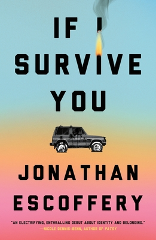
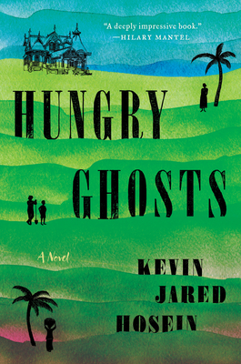

# 📚 &nbsp; January 2025

 

## Titles  
> A list of 6 novels from Caribbean literature  

   

**When We Were Birds** by Ayanna Lloyd Banwo &nbsp; \| &nbsp; *novel*  

  

&#8594; [goodreads link](https://www.goodreads.com/book/show/58065031-when-we-were-birds)  

 
 

**A Sun to Be Sewn** by Jean D'amérique &nbsp; \| &nbsp; *novel*    

  

&#8594; [goodreads link](https://www.goodreads.com/book/show/63990077-a-sun-to-be-sewn)  

 
   

**Reinbou** by Pedro Cabiya  &nbsp; \| &nbsp; *novel*  

  

&#8594; [goodreads link](https://www.goodreads.com/book/show/176729878-reinbou)  

 
   

**If I Survive You** by Jonathan Escoffery  &nbsp; \| &nbsp; *novel*   

  

&#8594; [goodreads link](https://www.goodreads.com/book/show/59808611-if-i-survive-you)  

 
 

**Hungry Ghosts** by Kevin Jared Hosein &nbsp; \| &nbsp; *novel*      

  

&#8594; [goodreads link](https://www.goodreads.com/book/show/61109596-hungry-ghosts)  

 
 

**River Sing Me Home** by Eleanor Shearer &nbsp; \| &nbsp; *novel*     

  

&#8594; [goodreads link](https://www.goodreads.com/book/show/61111298-river-sing-me-home)     

   
  
   
  
   
  
   
  
   
  
      
  
`Made in BKLYN, made with 💙.`
